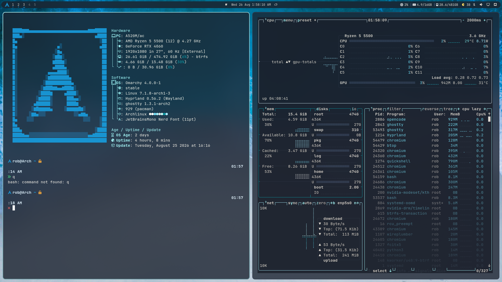

# omarchy-archlinux-setup

One-command install of my **Archlinux Omarchy desktop** — a dark, twilight-sky
theme plus the personal shell setup that goes with it.

- **Theme:** mint accent `#abfeff`, dusky-navy surfaces, peach `#e0916a`
  counter-accent, frosted-glass translucency.
- **Replica:** the bar layout, plugins, fastfetch, and update script exactly as
  used on the source machine.

<p align="center">
  
</p>

---

## What's in here

```
omarchy-archlinux-setup/
├── README.md                  this guide
├── install.sh                 one command, full setup
├── colors.toml                ┐
├── shell.*.toml               │ the Omarchy theme
├── ghostty.conf               │
├── icons.theme                │
├── preview.png                ┘
├── backgrounds/beach.jpg      bundled wallpaper
└── dotfiles/                  the personal replica
    ├── shell.json             bar layout
    ├── plugins/rob.*          bar plugins (clock, menu, vitals, updates, workspaces)
    ├── bin/system-update-count
    └── fastfetch/config.jsonc
```

---

## Install

```bash
git clone https://github.com/computerstuff1/omarchy-archlinux-setup
cd omarchy-archlinux-setup
./install.sh   DON'T USE
```

That's it. The script:

1. Stages the theme into `~/.config/omarchy/themes/archlinux`
2. Adds frosted-glass blur to `~/.config/hypr/looknfeel.lua`
3. Installs your plugins, bar layout, fastfetch, and the update script
4. Applies the theme and reloads Hyprland

**Re-runnable:** safe to run any time — the first run saves timestamped backups
of anything it overwrites (`shell.json`, `plugins/`, fastfetch), later runs just
refresh everything to this repo's state. It never deletes your personal settings.

> **Note:** the "Applying theme" step may pause for up to ~30 seconds — this is
> normal. The theme actually swaps in within a couple of seconds; the pause is
> Omarchy's post-apply app re-tinting stalling, which the script caps with a
> timeout. If you want, verify afterwards with `omarchy theme current` and
> `hyprctl configerrors`.

---

## Customizing

Edit a file here, then re-run `./install.sh`:

| Want to change | Edit |
|---|---|
| Theme colors | `colors.toml` |
| Shell surfaces (bar/menus/popups) | `shell.*.toml` |
| Terminal colors/opacity | `ghostty.conf` |
| Bar layout | `dotfiles/shell.json` |
| Bar widgets | `dotfiles/plugins/rob.*` |
| fastfetch | `dotfiles/fastfetch/config.jsonc` |

Your **non-color** personal settings are never touched: ghostty's general config
(font, keybindings, padding) lives in `~/.config/ghostty/config`, and Hyprland's
bindings/monitors/input live in `~/.config/hypr/*.lua`.

---

## Notes

- **Frosted glass** requires Hyprland blur; `install.sh` enables it
  (`decoration:blur`) and blurs the bar layer.
- **fastfetch** is intentionally standalone (not theme-driven): its config is
  installed once, with this theme's colors baked in as palette-independent hex.
- The bundled `backgrounds/beach.jpg` is auto-selected as the wallpaper when the
  theme is applied. Drop more images into
  `~/.config/omarchy/backgrounds/archlinux/` to cycle them.
- This repo is not meant for `omarchy theme install` (that would install it
  under the wrong theme name); `./install.sh` is the supported path.

---

## Palette

| Token | Hex | Role |
|---|---|---|
| `accent` | `#abfeff` | mint — interactive color |
| `background` | `#1a1f2b` | dusky navy |
| `dark_background` | `#12151e` | deeper panels |
| `darker_background` | `#0b0d13` | deepest layer |
| `lighter_background` | `#242b3a` | cards / raised |
| `foreground` | `#dcd6ce` | warm wheat-white |
| `light_foreground` | `#e8e3da` | warm near-white |
| `dark_foreground` | `#948e91` | muted text |
| `bright_foreground` | `#f5f1e8` | brightest text |
| `selection` | `#2c3547` | cool navy selection |
| `muted` | `#262d3a` | placeholders |
| `red` / `yellow` | `#aaf1ff` / `#cbfff9` | minted alerts |
| `green` / `cyan` / `blue` / `magenta` | `#0397a4` / `#77e0f8` / `#e3e3e3` / `#E2F6FF` | twilight hues |
| `brown` / `orange` | `#8a6a52` / `#e0916a` | umber / peach |
| `bright_*` | `#d9836f` … `#c29ebd` | brightened ANSI |
| active border | `#BEFDFD #56878F 45deg` | frosted gradient |
| inactive border | `#2c3547` | |